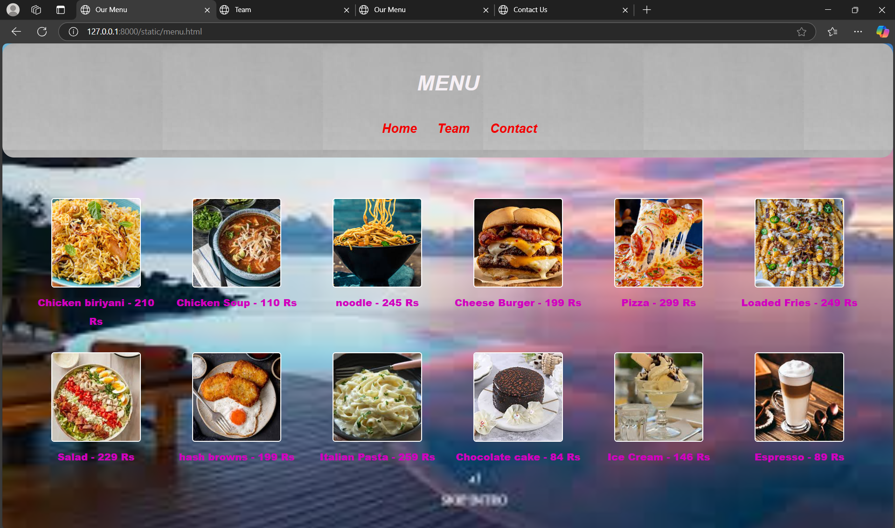
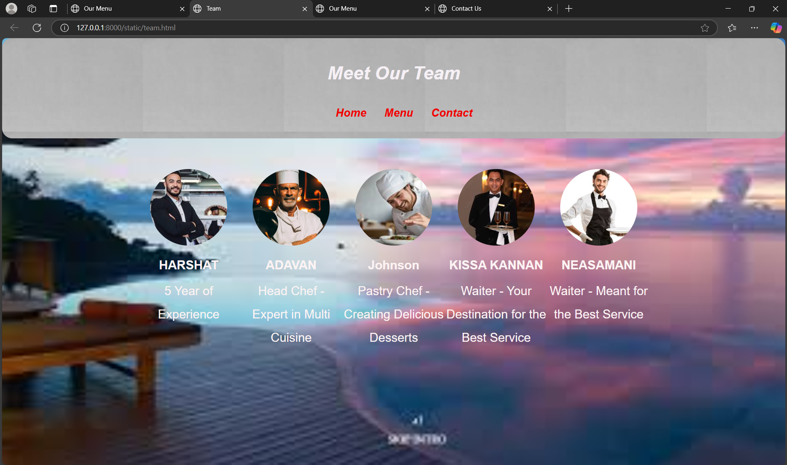
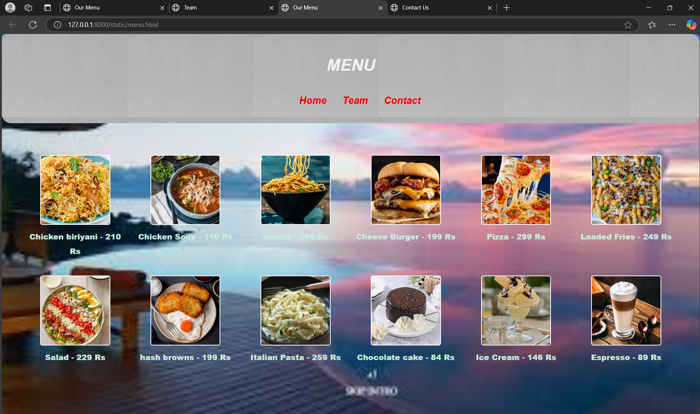
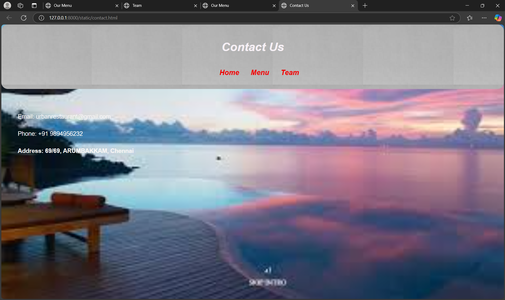

# Ex.07 Restaurant Website
# Date:
# AIM:
To develop a static Restaurant website to display the food items and services provided by them.

# DESIGN STEPS:
## Step 1:
Requirement collection.

## Step 2:
Creating the layout using HTML and CSS.

## Step 3:
Updating the sample content.

## Step 4:
Choose the appropriate style and color scheme.

## Step 5:
Validate the layout in various browsers.

## Step 6:
Validate the HTML code.

## Step 7:
Publish the website in the given URL.

# PROGRAM:
HOME.html
```
<!DOCTYPE html>
<html lang="en">
<head>
    <meta charset="UTF-8">
    <meta name="viewport" content="width=device-width, initial-scale=1.0">
    <title>URBAN FORKS</title>
    <meta charset="UTF-8">
    <meta name="viewport" content="width=device-width, initial-scale=1.0">
    <title>URBAN FORKS</title>
    <link rel="stylesheet" href="styles.css">
</head>
<body>
    <header>
        <h1>WELCOME TO URBAN FORKS CHAIN OF RESTAURANTS</h1>
        <nav>
            <ul>
                <li><a href="#about">About Us</a></li>
                <li><a href="menu.html">Menu</a></li>
                <li><a href="team.html">Team</a></li>
                <li><a href="contact.html">Contact</a></li>
            </ul>
        </nav>
    </header>
    
    

    <section id="about">
        <h2>About Us</h2>
        <p>Welcome to URBAN FORKS Restaurant, where we serve the finest dishes made from the fresh ingredients. Our chefs are dedicated to providing you with an unforgettable dining experience.</p>
    </section>
    <div class="image-row">
        
        
        
    </div>
    

</body>
</html>
```
menu.html
```
<html>
<head>
    <meta charset="UTF-8">
    <meta name="viewport" content="width=device-width, initial-scale=1.0">
    <title>Our Menu</title>
    <link rel="stylesheet" href="styles.css">
</head>
<body>
    <header>
        <h1>MENU</h1>
        <nav>
            <ul>
                <li><a href="index.html">Home</a></li>
                <li><a href="team.html">Team</a></li>
                <li><a href="contact.html">Contact</a></li>
            </ul>
        </nav>
    </header>
    <section>
        <div class="menu-grid">
            <div class="menu-item">
                
                <p>Chicken biriyani - 210 Rs</p>
            </div>
            <div class="menu-item">
                
                <p>Chicken Soup - 110 Rs</p>
            </div>
            <div class="menu-item">
                
                <p>noodle - 245 Rs</p>
            </div>
            <div class="menu-item">
                
                <p>Cheese Burger - 199 Rs</p>
            </div>
            <div class="menu-item">
                
                <p>Pizza - 299 Rs</p>
            </div>
            <div class="menu-item">
                
                <p>Loaded Fries - 249 Rs</p>
            </div>
            <div class="menu-item">
                
                <p>Salad - 229 Rs</p>
            </div>
            <div class="menu-item">
                
                <p>hash browns - 199 Rs</p>
            </div>
            <div class="menu-item">
                
                <p>Italian Pasta - 259 Rs</p>
            </div>
            <div class="menu-item">
                
                <p>Chocolate cake - 84 Rs</p>
            </div>
            <div class="menu-item">
                
                <p>Ice Cream - 146 Rs</p>
            </div>
            <div class="menu-item">
                
                <p>Espresso  - 89 Rs</p>
            </div>
        </div>        
    </section>
</body>
</html>
```
team.html
```
<html>
<head>
    <meta charset="UTF-8">
    <meta name="viewport" content="width=device-width, initial-scale=1.0">
    <title>Team</title>
    <link rel="stylesheet" href="styles.css">
</head>
<body>
    <header>
        <h1>Meet Our Team</h1>
        <nav>
            <ul>
                <li><a href="index.html">Home</a></li>
                <li><a href="menu.html">Menu</a></li>
                <li><a href="contact.html">Contact</a></li>
            </ul>
        </nav>
    </header>
    <section>
        <div class="team">
            <div class="team-member">
                
                <p><b>HARSHAT</b></p>
                <p>5 Year of Experience</p>
            </div>
            <div class="team-member">
                
                <p><b>ADAVAN</b></p>
                <p>Head Chef - Expert in Multi Cuisine</p>
            </div>
            <div class="team-member">
                
                <p><b>Johnson</b></p>
                <p>Pastry Chef - Creating Delicious Desserts</p>
            </div>
            <div class="team-member">
                
                <p><b>KISSA KANNAN</b></p>
                <p>Waiter - Your Destination for the Best Service</p>
            </div>
            <div class="team-member">
                
                <p><b>NEASAMANI</b></p>
                <p>Waiter - Meant for the Best Service</p>
            </div>
        </div>
    </section>
</body>
</html>
```
contact.html
```
<html>
<head>
    <meta charset="UTF-8">
    <meta name="viewport" content="width=device-width, initial-scale=1.0">
    <title>Contact Us</title>
    <link rel="stylesheet" href="styles.css">
</head>
<body>
    <header>
        <h1>Contact Us</h1>
        <nav>
            <ul>
                <li><a href="index.html">Home</a></li>
                <li><a href="menu.html">Menu</a></li>
                <li><a href="team.html">Team</a></li>
            </ul>
        </nav>
    </header>
    <section>
        <p>Email: urbanrestaurant@gmail.com</p>
        <p>Phone: +91 9894956232</p>
        <b>Address: 69/69, ARUMBAKKAM, Chennai</b>
    </section>
    
</body>
</html>
```
styles.css
```
body {
    font-family: Arial, sans-serif;
    margin: 0;
    padding: 0;
    line-height: 1.9;
    font-size: large;
    background-image: url('back.jpg');
    background-size: cover; 
    background-position: center;
    background-repeat: no-repeat; 
    height: 100vh;
    color: rgb(248, 246, 246);
}
header {
    background-image: url('back2.jpg'); 
    color: rgb(246, 240, 245);
    padding: 10px 0;
    text-align: center;
    font-style: oblique;
    border-radius: 20px;
}


nav ul li {
    display: inline;
    margin: 0 15px;
}

nav ul li a {
    color: rgb(239, 0, 0);
    text-decoration: none;
    font-weight: bold;
    font-size: larger;
}

section {
    padding: 20px;
    margin: 30px;
}


footer {
    text-align: center;
    padding: 10px 0;
    background: #050602;
    color: rgb(9, 9, 9);
    position: fixed;
    bottom: 0;
    width: 100%;
    

    
}

.menu-grid {
    display: grid;
    grid-template-columns: repeat(6, 1fr); 
    gap: 20px;
    margin: 20px auto;
    text-align: center;
}

.menu-item img {
    width: 150px;
    height: 150px; 
    object-fit: cover; 
    border: 2px solid #ffffff; 
    border-radius: 5px; 
    display: block; 
    margin: 0 auto; 
}

.menu-item p {
    margin-top: 10px; 
    font-size: 17px; 
    color: #d100bf; 
    font-weight: 800;
}

.team {
    display: flex;
    justify-content: center;
    flex-wrap: wrap; 
    gap: 75x; 
    margin: 10px auto;
    max-width: 1200px; 
}

.team-member {
    text-align:center;
    width: 200px; 
}

.team-img {
    width: 150px; 
    height: 150px; 
    object-fit: cover; 
    border-radius: 50%;
    margin-bottom: 10px;
}

.team-member p {
    margin: 5px 0;
    font-size: 24px;
    color: #fcf3f3;
}
.image-row {
    display: flex; 
    justify-content: center; 
    gap: 25px;
    margin: 20px 0; 
}

.image-row img {
    border: 6px solid #0a0a0a; 
    border-radius: 20px; 
}
```
# OUTPUT:




# RESULT:
The program for designing software company website using HTML and CSS is completed successfully.
